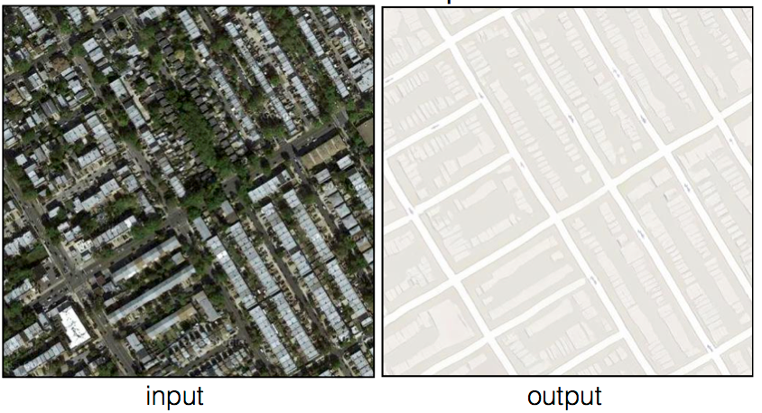

# Pix2Pix Maps

PyTorch implementation of Pix2Pix for paired image-to-image translation on the
Maps dataset.

The model uses a U-Net generator and a PatchGAN discriminator.

## Example



## Installation

```bash
python -m pip install -e .
```

## Dataset

```bash
python scripts/download_dataset.py
```

## Training

```bash
python scripts/train.py
```

Training resumes from `checkpoints/maps_pix2pix/latest.pth` when available.

## Configuration

Edit training defaults in:

```text
src/pix2pix/config.py
```
